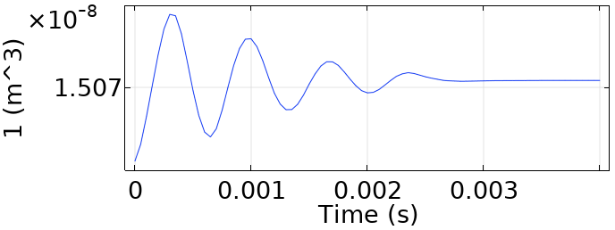

# COMSOL Simulations

## 01 - PDMS Channel Inlet Punch Swelling

**Description**: 

* Polydimethylsiloxane (PDMS) Elastomer based microfluidic devices usually have a punch hole of the order of millimeters where inlet / outlet tubings are connected. 
* This single phase laminar flow + solid mechanics multiphysics simulation describes the response of the punch hole volume because of pressure driven flow across it.   
* The concept can be extended to whole microfluidic devices as well as other fluidic systems, this demonstration has been kept as simple as possible for easy adaptability.
* Steady state volume difference is useful for characterizing the flow resistance, capacitance etc.  
* A coarse grid has been used in the simulation to reduce file size to upload on GitHub with solutions and results to help beginners
* Note: Every time the simulation is run, delete Table 1, regenerate it using Results > Derived Values > Volume Integration and make a table graph to see volume vs time results.
* Time dependent study plots GIF given below at each time step for user.
#    
 
  
